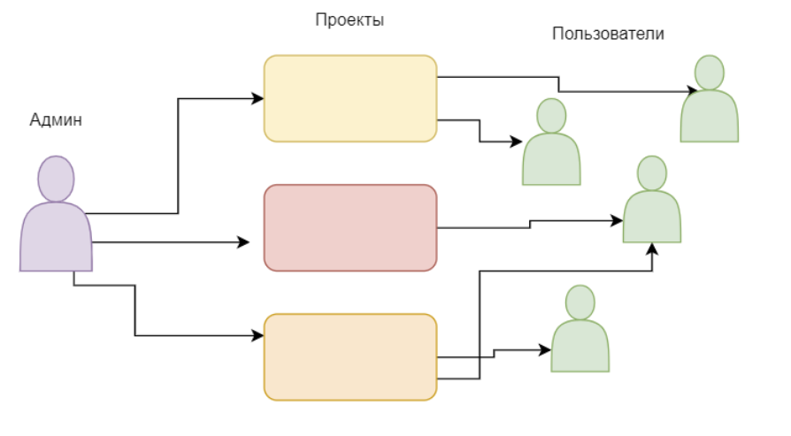
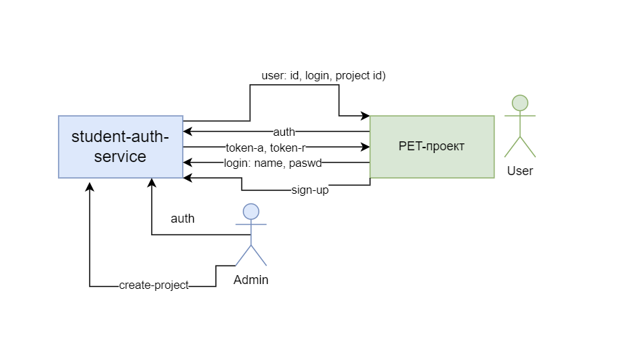
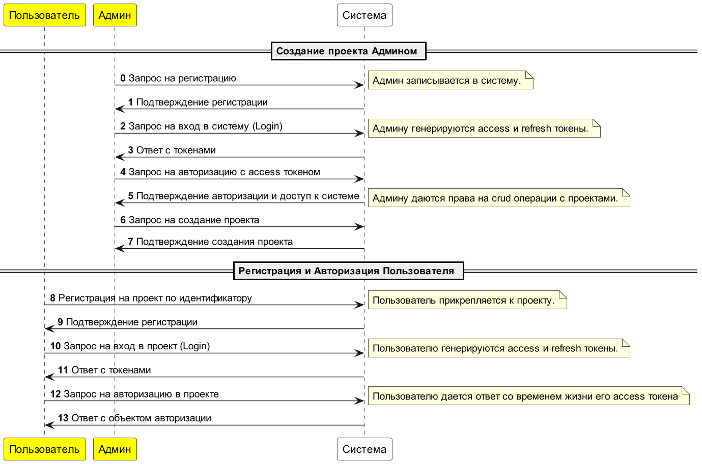
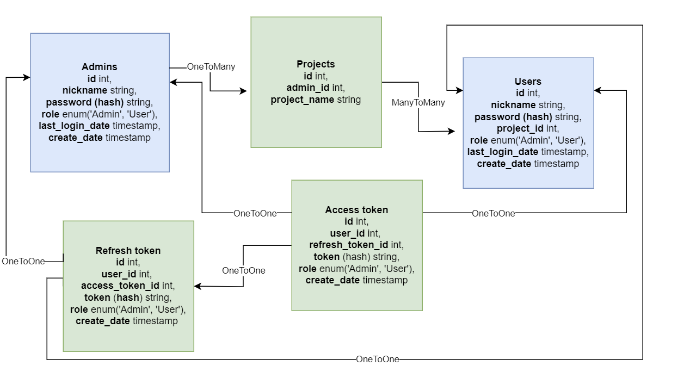
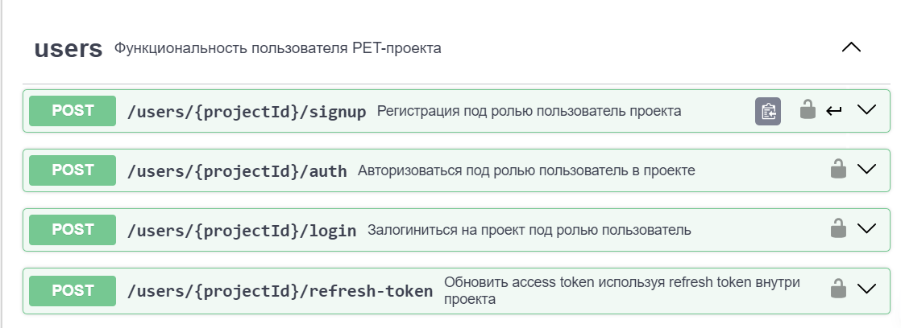
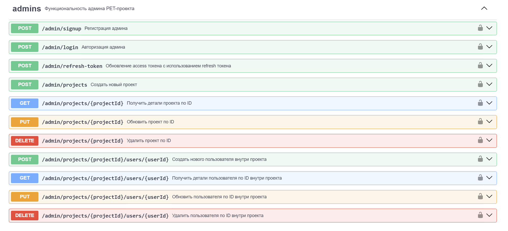
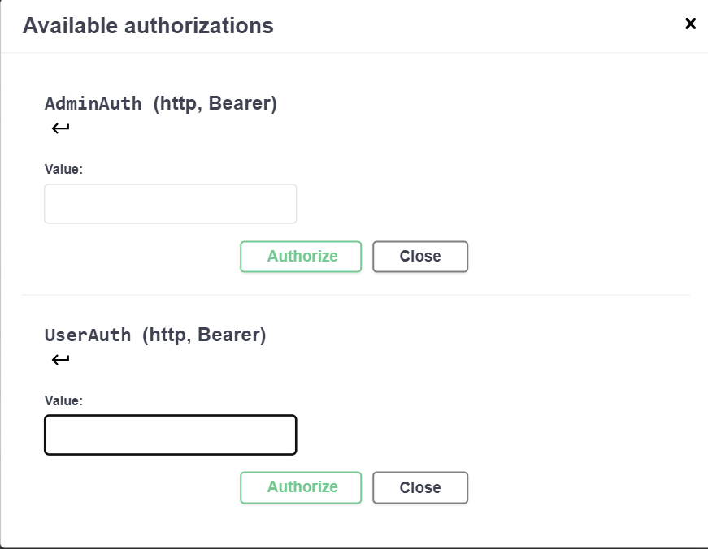

### Student-Auth-Prototype
***Прототип сервиса авторизации и управления пользователями для начинающих back-end разработчиков***

1. Схема связей пользователей

2. Инженерная схема работы

3. Sequence диаграмма основной потребности в авторизации

4. Архитектура БД

4. Open API

